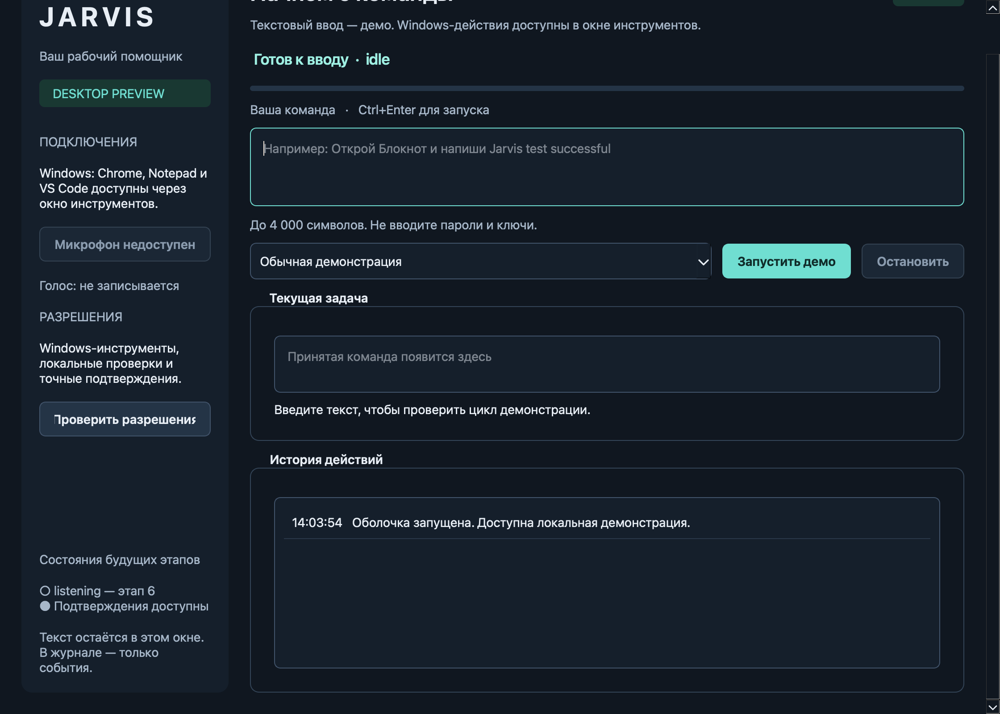

# JARVIS for Windows

Локальный AI-ассистент для Windows 11: текстовые и голосовые команды, строго
типизированные инструменты, подтверждение внешних действий и проверяемый журнал.

**Текущий этап: 9 — подготовка установки и Windows E2E.** Установщик написан;
приёмка на чистой Windows ещё не пройдена. Кнопка «Планировщик команд» открывает
многошаговое выполнение с уточнениями, остановкой и подтверждением каждого CONFIRM шага.
По умолчанию включён офлайн-планировщик; главная строка команд выполняет действия,
планировщик в отдельном окне по-прежнему стартует в симуляции. Добавлен адаптер OpenAI Responses
API; реальный запрос требует настройки ключа/модели и пока не проверен на живом API.
В окне инструментов доступны восемь
браузерных действий: открытие, переход, поиск, чтение, ввод, клик, список и закрытие вкладок.
Playwright работает в отдельном анонимном сеансе; переходы и изменения требуют точного
подтверждения. Поддерживаются статические страницы без JavaScript и GET-формы.
Произвольная отправка POST отключена; существующий профиль браузера не используется.
**Полная native Windows-приёмка ещё не выполнена**, но выполнение команд из главной
строки проверено на Windows 11 (см. «Что проверено на Windows» ниже).
Главная строка команд выполняет команды по-настоящему: она запускает тот же планировщик и проходит через движок разрешений. Режим выполнения, провайдер и автономное подтверждение выбираются под сферой. Добавлен локальный голос; настоящий микрофон/распознавание/звук ещё не проверены. Добавлена вкладка Outlook: чтение, локальные/удалённые черновики и отправка с точным подтверждением. Живой OAuth и доставка ещё не проверены.

### Что проверено на Windows 11 (эта правка)

На Windows 11 Pro 26200, Python 3.13 x64, из исходников:

- `python -m pytest` — 465 passed, 6 skipped; `ruff check`, `ruff format --check`, `mypy` — чисто.
- `python -m jarvis --smoke-test` — `Jarvis GUI smoke: success (simulated)`.
- Команда «открой блокнот», введённая в главную строку в режиме «Выполнять действия»:
  статус `finished`, шаг `windows.open_app: SUCCESS`, реально запущен `Notepad.exe`,
  в `shell.jsonl` — `command_submitted → command_executing → command_succeeded`.
- Уточняющий вопрос по незнакомой команде появляется в главном окне и продолжает задачу
  после ответа.
- Живой OpenAI: ключ читается из хранилища Windows, `gpt-4.1`, `gpt-5.1` и `gpt-5-mini`
  отвечают на «открой блокнот и напиши туда привет» корректным вызовом `windows.open_app`.
- Файлы на реальной Windows через PermissionEngine: `files.find`, `files.write_text` и
  `files.recycle` — SUCCESS; удалённый файл найден в корзине и восстановим, соседний файл
  не тронут, путь вне разрешённых папок отклонён ещё на подготовке действия.
- Полный путь ввода на реальной Windows через PermissionEngine:
  `windows.open_app` → `windows.get_text_fields` → `windows.type_text` — все три SUCCESS,
  в поле оказался ровно переданный текст (совпадение по SHA-256).
- Команда «открой калькулятор» из главной строки: статус `finished`,
  `windows.open_app: SUCCESS`, реально открылось Store-приложение «Калькулятор».
- Запуск по имени `powershell`, `командную строку` и несуществующего приложения отклонён
  на этапе проверки, без запуска процесса.

Не проверено вживую: **микрофон и распознавание речи** (нужен ваш голос и ваше согласие;
проводка проверена тестом на готовом транскрипте), автономное подтверждение шага
`windows.type_text` на этой машине (требуется пустой Блокнот; механизм покрыт
интеграционным тестом на инструменте `local.append_message`), живой OpenAI API и Outlook.



## Установка на Windows по одному запросу

Откройте **полную текущую копию репозитория** в Codex на Windows 11 x64 и напишите:

> Установи Jarvis на этот ноутбук и проверь, что он запускается.

Агент запускает из корня репозитория:

```powershell
& '.\scripts\windows\Install-Jarvis.cmd'
```

Сценарий готовит Python, отдельное окружение приложения, Chromium и русскую модель Vosk,
проверяет зависимости и окно, создаёт **Jarvis** в меню «Пуск». Для первой установки нужны
интернет и минимум 3 GB свободного места; Python/pip вручную не требуются. Повторная команда
проверяет и восстанавливает компоненты. Данные и системные credentials хранятся отдельно.
Если системного русского голоса нет, отчёт укажет его установку через настройки Windows.
Микрофон, OAuth/MFA и точные подтверждения остаются явными действиями пользователя.

**Windows-установщик пока не прошёл native-приёмку.**
[Устройство и ограничения](docs/MILESTONE_9.md) ·
[Команды и приёмочная матрица](docs/WINDOWS_ACCEPTANCE.md).
CMD задаёт execution policy только дочернему процессу PowerShell; системные политики
не изменяются, Group Policy/SmartScreen/UAC не обходятся. Ярлык запускается через Python,
без PowerShell и зависимости от расположения репозитория.

## Запуск из исходников для разработчика: Windows 11, PowerShell

Установите Python 3.12 x64 с python.org и Git. Из выбранного каталога:

```powershell
git clone git@github.com:xumezzan/JARVIS-Windows.git
cd JARVIS-Windows
py -3.12 -m venv .venv
.\.venv\Scripts\python.exe -m pip install -e ".[dev]"
.\.venv\Scripts\python.exe -m playwright install chromium
.\.venv\Scripts\python.exe -m jarvis
.\.venv\Scripts\jarvis.exe --version
```

Клонирование требует SSH-доступа к GitHub и наличия опубликованных файлов.
Если вы уже открыли рабочую копию, начните с создания `.venv`.
Активировать окружение и менять PowerShell ExecutionPolicy не требуется.

Откроется окно **JARVIS • Desktop Preview**. Введите команду и нажмите кнопку
со стрелкой или Ctrl+Enter. Escape и «Остановить» отменяют выполнение.

Под сферой три переключателя:

- **Выполнять действия / Только симуляция** — реальный запуск инструментов или проверка
  разрешений без эффектов.
- **Офлайн: учебные команды / OpenAI: любые команды** — офлайн понимает фиксированный
  набор формулировок; произвольные команды требуют ключа и модели OpenAI.
- **Автономно: не подтверждать каждый шаг** — шаги риска CONFIRM получают одноразовый
  токен без диалога. Снимите флажок, чтобы просматривать каждое такое действие.

**Уровни риска.** Обычная обратимая работа на вашей машине — печать текста, навигация и
клики в браузере, запись, переименование и открытие файла, черновик письма — имеет уровень
`ROUTINE` и выполняется без подтверждения вообще, даже со снятым флажком автономности.
Подтверждение осталось там, где ошибка стоит дорого и необратима: удаление в корзину,
отправка письма, создание и изменение встреч. Матрица владельца может поднять `ROUTINE`
до `CONFIRM`, но не опустить `CONFIRM` до `ROUTINE`.

Микрофон — круглая кнопка под сферой: удерживайте её (или пробел на ней) и говорите.
Распознанная команда запускается сразу, итог проговаривается вслух. Распознавание
локальное (Vosk); модель, установленная инсталлятором, подхватывается автоматически.

**Подтверждение голосом.** В окне подтверждения `CONFIRM`-действия ассистент называет
контрольную деталь самого действия — слово из имени удаляемого файла, из темы письма или
встречи — и показывает её на экране. Произнесите это слово, и подтверждение будет выдано;
общее «да» не подтверждает ничего. «Отмена», сказанная вслух, отказывает. Неуверенное
распознавание, другое слово и истёкший снимок подтверждением не считаются, а кнопка
остаётся на месте: голос добавляет канал, а не отбирает существующий. Микрофон при этом
открывается по нажатию «Слушать подтверждение голосом» — или сам, если уже включены
свободные руки. Действие, в снимке которого нет произносимой детали, подтверждается
только кнопкой.

**Отчёт о сделанном.** В конце задачи ассистент говорит и показывает не статусы движка, а
то, что он сделал: «Готово. Отправил письмо «Перенос встречи» на ivan@example.com. Создал
встречу «Планёрка» на 17 сентября, 18:00.» Если действие могло уйти, но подтвердить его не
удалось, так и сказано — «отправил, но подтвердить не смог, проверьте». Текст собирается из
снимка действия, который вы сами вызвали и видели в подтверждении: ни ответ сервиса, ни
текст модели, ни содержимое письма или файла туда не попадают. Вслух адреса и пути не
произносятся — они остаются на экране.

**Рутины.** Вкладка «Рутины» в окне планировщика — это то, что ассистент замечает сам.
Три выключателя, и все по умолчанию выключены: сначала «Рутины работают», затем каждая
рутина по отдельности, и только потом отдельное разрешение выполнять обратимую работу без
вас. Наблюдение только читает. Всё, что требует подтверждения, рутина не выполняет ни при
каких настройках — оно ждёт в списке предложений и открывается в том же окне подтверждения,
кнопкой или голосом. Рутина, не нашедшая повода, не показывает и не говорит ничего: тишина
здесь — обычный исход. В сутки разрешено 48 циклов; счётчик виден в панели и переживает
перезапуск. Встроенных рутин три: встреча вот-вот начнётся, повестка ближайших двенадцати
часов в файле «Встречи.txt», новое письмо во «Входящих». Первая и третья только сообщают;
вторая умеет записать файл сама, если вы это разрешили именно ей.

**Свободные руки.** Переключатель «Свободные руки: слушать по слову «Джарвис»» держит
микрофон открытым без удержания кнопки. Фраза заканчивается сама на паузе примерно в
секунду. Выполняется только то, что произнесено после обращения: «Джарвис, открой
калькулятор» запустит `открой калькулятор`, а обычный разговор в комнате будет пропущен
с пометкой в строке состояния. Режим **выключен по умолчанию**, включается только вручную,
всё время показывает «● Слушаю», и выключается сам при ошибке микрофона, закрытии окна и
завершении приложения. Решение о том, где заканчивается фраза, принимается только по
громкости блоков — содержимое звука при этом не анализируется.

Офлайн-режим понимает: «открой <название приложения>» («запусти», «включи» — синонимы),
«проверь систему», «проверь систему дважды», «открой блокнот и напиши «…»»,
«открой https://…», «найди …», «открой chrome и найди …». Остальные формулировки вызывают
уточняющий вопрос.

**Файлы.** Доступны поиск, просмотр папки, чтение текста, создание и замена текстового
файла, переименование, удаление **в корзину** и открытие документа в его обычном
приложении. Работа идёт только внутри разрешённых папок: по умолчанию это ваши
«Desktop», «Documents», «Downloads», «Pictures», «Music», «Videos», и ни установка, ни
репозиторий, ни системные каталоги туда не входят. Путь сначала разрешается, а потом
проверяется, поэтому ссылка или «..» не выводят наружу. Исполняемые файлы и скрипты
не создаются, не переименовываются и не открываются. Существующий файл не заменяется,
пока замена не запрошена явно. **Безвозвратного удаления нет** — только корзина, и папки
целиком не удаляются. Список папок задаётся переменной `JARVIS_FILE_ROOTS`.

**Ввод текста.** `windows.type_text` больше не ограничен пустым Блокнотом: писать можно
в любое поле, которое ассистент увидел в этой же задаче через `windows.get_text_fields`.
Поля с паролем и поля только для чтения не являются целями никогда, содержимое полей
не попадает в наблюдения и не уходит модели, а существующий текст сохраняется, пока явно
не запрошена замена. Если у поля нет собственного окна (браузер, Electron), используется
штатный value pattern приложения — не эмуляция клавиш, не буфер обмена, не координаты.

**Приложения больше не ограничены списком.** Название сопоставляется с папкой приложений
Windows, меню «Пуск», реестром App Paths и системными программами, поэтому открываются и
Store-приложения («Калькулятор»), и обычные («Telegram», «WinRAR»). Неоднозначное название
возвращает ошибку `application_ambiguous`, неизвестное — `application_missing`.
Командные оболочки и интерпретаторы (cmd, PowerShell, wscript, mshta и подобные) по имени
не запускаются: это превратило бы произнесённое слово в запуск произвольного кода.
Ввод текста идёт в поле, которое ассистент наблюдал в этой же задаче, и имеет уровень
`ROUTINE`: подтверждение не запрашивается.
Отдельное окно планировщика содержит те же запуски плюс память, Outlook и голос.
Запись начинается только по удержанию кнопки в планировщике.

Для автоматической проверки с открытием и закрытием окна:

```powershell
.\.venv\Scripts\python.exe -m jarvis --smoke-test
```

Ожидаемый результат: `Jarvis GUI smoke: success`, exit code 0.

## Проверка разрешений

1. Нажмите «Открыть инструменты». Simulation Mode включён по умолчанию.
2. SAFE проверяется без диалога; итог симуляции — `SIMULATED`, adapters не вызываются.
3. Выберите CONFIRM, проверьте аккаунт, получателя, тему и содержание.
4. Нажмите «Подготовить и запустить». Диалог показывает точный неизменяемый снимок,
   включая сервис, тип действия, режим и пустой список вложений.
5. Только кнопка «Подтвердить показанное действие» выдаёт одноразовое разрешение.
   Отмена, закрытие, истечение 60 секунд и изменение снимка запрещают выполнение.
6. Если снять Simulation Mode, подтверждённое сообщение добавится только в память
   локального тестового ящика. Счётчик доказывает эффект, внешней отправки нет.
7. CRITICAL и BLOCKED всегда отклоняются. Stop/Escape отменяют незавершённую задачу.

Тестовый ящик очищается при закрытии окна инструментов. Тестовый ящик не использует SMTP/OAuth или сеть. Новое действие с теми же данными требует нового подтверждения.

## Голосовые команды (этап 6)

Установите необязательные голосовые зависимости в окружение проекта:

```powershell
.\.venv\Scripts\python.exe -m pip install -e ".[dev,voice]"
.\.venv\Scripts\python.exe -m jarvis
```

Скачайте и распакуйте русскую модель из [официального списка Vosk](https://alphacephei.com/vosk/models),
например `vosk-model-small-ru-0.22`. В планировщике выберите её папку, содержащую `am/final.mdl`.
Приложение не скачивает модели автоматически. Для озвучивания нужен установленный
русский системный голос; оно включается отдельным флажком.

1. Нажмите микрофон на главном экране — откроется планировщик, запись ещё не ведётся.
2. Удерживайте «Удерживайте для записи команды» мышью или пробелом на кнопке.
   Дождитесь «Идёт запись» и скажите `проверь систему дважды`. Отпустите кнопку.
3. Проверьте и при необходимости исправьте расшифровку в поле команды.
   Нажмите «Запустить планировщик». По умолчанию инструменты симулируются.
4. Во время задачи можно удержать кнопку и сказать `стоп` или `отмена`. Это доступно
   также в окне подтверждения. Голос не подтверждает действия; используйте точную кнопку approval.
5. Stop/Escape/закрытие отменяют работу. Запись ограничена 30 секундами, весь голосовой
   сеанс с проверкой текста — 5 минутами. Во время озвучивания микрофон выключен.

По умолчанию распознавание и озвучивание локальные: аудио не передаётся в облако и не сохраняется.
Если выбран OpenAI-планировщик, проверенный текст отправляется только после его отдельного
разрешения на передачу. Ни API-ключ, ни облачный провайдер для локального голоса не нужны.
См. [результаты и Windows-приёмку этапа 6](docs/MILESTONE_6.md).

### Дополнительный голос ElevenLabs Free

В планировщике доступна кнопка **Настроить голос ElevenLabs Free…**: защищённое
сохранение ключа, список стандартных голосов, проба и согласие на одну облачную озвучку.
Перед синтезом проверяются Free-тариф и остаток лимита; платные аккаунты блокируются.
Нужен личный Free-аккаунт. [Подключение, передача текста и ограничения](docs/ELEVENLABS.md).
Живой API и звучание ещё не проверены.

## Планировщик текстовых команд

1. Нажмите «Планировщик команд». Начните с `проверь систему дважды` и включённой симуляции.
2. Офлайн-провайдер понимает учебные команды: `проверь систему`, `открой блокнот`,
   `открой блокнот и напиши «Привет»`, `открой https://example.com/`, `найди OpenAI`.
   Для произвольных формулировок выберите OpenAI. Офлайн-режим не является LLM.
3. Для реальных инструментов снимите Simulation Mode. Каждый CONFIRM шаг останавливается
   на полном неизменяемом preview; подтвердить весь план заранее нельзя.
4. Вопрос планировщика требует текстового ответа и не выдаёт разрешения на действие.
   Stop/закрытие окна отменяют ожидание. Итог показывает фактические статусы инструментов.
5. Лимиты: 8 действий, 3 уточнения, 30 секунд на ответ провайдера и 180 секунд на задачу,
   включая ожидание подтверждений. Срок отдельного approval — 60 секунд. Повторов после
   ошибки нет; уже выданные действия не откатываются.

В симуляции нет наблюдений окон/страниц: зависимые шаги ввода и чтения не исполняются и
цели не выдумываются. Полная цепочка проверяется только в режиме реального выполнения.

Для OpenAI сохраните ключ **в терминале со скрытым вводом**, не в чате или `.env`:

```powershell
.\.venv\Scripts\python.exe -m jarvis.security.credentials set
.\.venv\Scripts\python.exe -m jarvis
```

На macOS: `.venv/bin/python -m jarvis.security.credentials set`. Используется Windows
Credential Locker / macOS Keychain, сервис `Jarvis/OpenAI`, аккаунт `default`.
Повторный `set` заменяет ключ; удалить его можно через системный менеджер учётных данных.
Linux backend на этом этапе не подключён; офлайн-режим доступен.

В окне выберите OpenAI, укажите доступную вашему API-аккаунту модель Responses API со
strict function calling и разрешите передачу команды, уточнений и результатов инструментов.
Идентификатор пишется без пробелов (`gpt-5.4-mini`, а не `gpt 5.4 mini`); окно не даёт
подтвердить, пока не отмечено согласие и не указан такой идентификатор. Ответ запоминается
в `<data_dir>/cloud-consent.json`, поэтому вопрос задаётся один раз; снимите галочку во
вкладке «Команда» планировщика, чтобы отозвать разрешение. API тарифицируется отдельно. Облачный планировщик обращается к модели даже при симуляции
инструментов. `store=false` не гарантирует отсутствие хранения у провайдера.
Доступность модели, ключа и живой API-сценарий нужно проверить отдельно:
[команды и ограничения этапа 5](docs/MILESTONE_5.md).

## Разработка на macOS/Linux

Можно запускать и проверять оболочку; это не доказывает работу на Windows.

```bash
python3.12 -m venv .venv
.venv/bin/python -m pip install -e '.[dev]'
.venv/bin/python -m playwright install chromium
.venv/bin/python -m jarvis
.venv/bin/python -m pytest
.venv/bin/python -m ruff check .
.venv/bin/python -m ruff format --check .
.venv/bin/python -m mypy
.venv/bin/python -m build
```

## Windows-инструменты

1. Нажмите «Открыть инструменты». Сначала выбран Simulation Mode.
2. Для реального запуска на Windows снимите Simulation Mode, выберите приложение,
   затем «Windows — открыть приложение». Уже открытое приложение используется повторно.
3. Выполните «Windows — список окон», выберите точное окно; «фокус на окно» проверяет фокус.
4. Для ввода выберите пустой редактор Блокнота. Существующий текст не заменяется;
   восстановленные вкладки нужно сохранить и подготовить пустую вкладку вручную.
5. Выберите «текст в пустой Блокнот», введите содержание и проверьте полный preview.
   После подтверждения текст записывается буквально и читается обратно для сравнения.
6. Stop/Escape завершают helper; уже переданное Windows действие может сохраниться.

Открытие и фокус поддерживают Notepad, Chrome и VS Code в стандартных каталогах установки.
Ввод поддерживает только пустой Notepad Edit/RichEdit с доступным native HWND; формы Chrome,
терминал VS Code, клавиатурные сочетания и submit не доступны. Другие редакторы отклоняются.
На macOS реальный Windows-запуск возвращает понятный отказ. В симуляции окна не ищутся;
для focus/type нужен ранее наблюдённый target, выдуманные окна UI не создаёт.

## Браузерные инструменты

1. Откройте инструменты. В Simulation Mode браузер не запускается, сеть не используется;
   схемы, разрешённые адреса и политика риска всё равно проверяются.
2. Для реального чтения снимите Simulation Mode, выберите «Браузер — открыть страницу»,
   оставьте `https://example.com/` и подтвердите точный адрес в диалоге.
3. После открытия появятся наблюдённая вкладка, заголовок, текст и доступные элементы.
   Для новой страницы сначала выполните чтение; ввод/клик используют только наблюдённые цели.
4. Поиск DuckDuckGo открывает новую вкладку. Введите `OpenAI`, проверьте полный URL
   и подтвердите. Запрос честно называет клиента (`Jarvis/<версия>`); браузер не имитируется.
   Наблюдением считается только статус 200 — challenge-ответ 202 отклоняется и не выдаётся
   за результаты. Ссылки выдачи ведут на другие origin и потому не становятся кликабельными.
5. Ввод буквальный, без Enter/клавиатурных сценариев. GET-формы показывают все поля и
   конечный адрес до подтверждения. POST, авторизация, загрузки, popup и редиректы запрещены.
6. Stop отменяет ожидание, но не отзывает уже выданный запрос. При сбое новой вкладки
   существующие вкладки сохраняются. Закрытие окна инструментов удаляет весь его временный
   сеанс, включая введённый текст; сохранения/восстановления сеанса пока нет.

Разрешены точные HTTPS origins из `JARVIS_BROWSER_ORIGINS`. По умолчанию: `example.com`,
`www.python.org`, `docs.python.org`, `lite.duckduckgo.com`. Добавление origin не разрешает
локальную/приватную сеть, POST или JavaScript. DNS проверяется при реальном запросе;
в симуляции DNS и доступность страниц не проверяются. Клики на результатах поиска другого
origin потребуют явной настройки allowlist. См. [ограничения этапа 4](docs/MILESTONE_4.md).

## Документация

- [PRD](docs/PRD.md): сценарии и границы MVP.
- [Архитектура](docs/ARCHITECTURE.md): модули, контракты и принятые решения.
- [Безопасность](docs/SECURITY.md): модель угроз и обязательные ограничения.
- [Roadmap](docs/ROADMAP.md): этапы и точный следующий prompt.
- [Тестирование](docs/TESTING.md): Windows-команды, приёмка и ограничения проверки.
- [Совместимость](docs/COMPATIBILITY.md): официальные источники и стратегия зависимостей.
- [Результаты этапа 4](docs/MILESTONE_4.md): браузер, проверки, ограничения и следующая задача.
- [Результаты этапа 6](docs/MILESTONE_6.md): локальный голос, команды приёмки и ограничения.
- [Результаты этапа 5](docs/MILESTONE_5.md): планировщик, настройка OpenAI и оставшаяся приёмка.
- [Результаты этапа 3](docs/MILESTONE_3.md): Windows-адаптер, проверки и открытая native-приёмка.
- [Результаты этапа 2](docs/MILESTONE_2.md): разрешения, тесты и ограничения.
- [Результаты этапа 1](docs/MILESTONE_1.md): проверки GUI и ограничения.
- [Результаты этапа 0](docs/MILESTONE_0.md): фактические проверки и остаточные риски.
- [AGENTS.md](AGENTS.md): правила работы в репозитории.

## Настройки и локальный журнал

Настройки читаются из переменных процесса. `.env.example` — справочник,
файлы `.env` автоматически не загружаются. Например, в PowerShell:

```powershell
$env:JARVIS_TASK_TIMEOUT_MS = "10000"
.\.venv\Scripts\python.exe -m jarvis
```

| Переменная | По умолчанию | Допустимые значения |
| --- | --- | --- |
| `JARVIS_TASK_TIMEOUT_MS` | 10000 | 100–60000 мс |
| `JARVIS_ACTIVITY_LIMIT` | 200 | 10–1000 строк |
| `JARVIS_FILE_ROOTS` | Ваши папки документов | Абсолютные пути через запятую; пустое значение запрещает работу с файлами |
| `JARVIS_BROWSER_ORIGINS` | Четыре origin выше | Точные HTTPS origins через запятую; пустое значение запрещает сеть |
| `JARVIS_DATA_DIR` | Каталог данных ОС | Путь к доступному каталогу |
| `JARVIS_PLANNER_MODEL` | Пусто | Несекретный ID модели Responses API; можно ввести в окне, заданная здесь имеет приоритет над запомненной |

Журнал: `<data_dir>/logs/shell.jsonl`, ротация 1 MB, два резервных файла.
Каталог по умолчанию: `%LOCALAPPDATA%\Jarvis` на Windows,
`~/Library/Application Support/Jarvis` на macOS, `$XDG_DATA_HOME/Jarvis`
(или `~/.local/share/Jarvis`) на Linux.

Команды и принятый текст остаются в окне и не сохраняются в журнале. Там только время,
session/request UUID и служебное событие из конечного списка. Микрофон включается только по удержанию кнопки в планировщике. Запущенные Chrome/VS Code могут выполнять собственные сетевые запросы.
Не вводите секреты. Shell log отделён от `<data_dir>/audit.sqlite3` — журнала инструментов. Audit содержит
время, session/request ID, инструмент, риск, режим, permission decision, статус, длительность,
категорию ошибки и признак возможного эффекта. Аргументы/результаты скрыты целиком, токены
не сохраняются. При недоступном обязательном audit adapter не запускается.

Каждый локальный, Windows и browser tool проходит PermissionEngine. Будущие adapters должны использовать
тот же шлюз. План модели
не является разрешением, а успешный план не является доказательством выполнения.

## Этап 7: память

В планировщике появилась вкладка **Память**: явное сохранение коротких меток профиля,
просмотр/изменение/удаление/очистка, ограниченный контекст текущего сеанса. Отметьте нужные
записи для одной задачи; передача меток в OpenAI требует отдельного согласия. Автоматического
сохранения речи, команд и страниц нет. «Открой выбранное приложение» использует выбранную
метку приложения и заново наблюдает Windows-окно. Контактные ссылки требуют уточнения.

[Описание, ограничения и приёмка Windows](docs/MILESTONE_7.md). Реальные Windows, LLM и голос
остаются непроверенными; внешние сервисы и установка из репозитория — следующие этапы.


## Outlook (этап 8)

**Планировщик → Outlook**: явный вход Microsoft, точный аккаунт, чтение, локальный черновик,
сохранение в Outlook и отправка через отдельное подтверждение. По умолчанию инструменты
работают в simulation. Настройка входа требует вашего Application (client) ID и согласия
в Microsoft; токены хранятся только в OS credential store. `202 Accepted` не доказывает доставку.

[Настройка, ограничения и Windows/почтовая приёмка](docs/MILESTONE_8.md).
Установщик по одному запросу подготовлен на этапе 9; его Windows-приёмка остаётся открытой.
