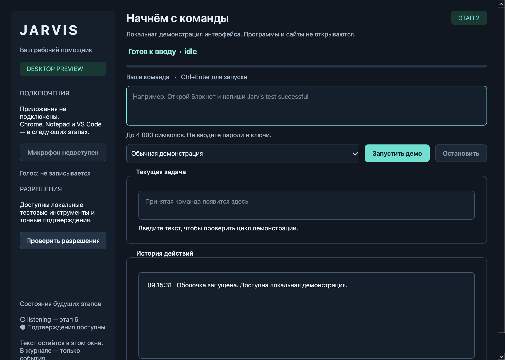

# JARVIS for Windows

Локальный AI-ассистент для Windows 11: текстовые и голосовые команды, строго
типизированные инструменты, подтверждение внешних действий и проверяемый журнал.

**Текущий этап: 2 — Tools & Permissions.** Добавлены типизированный реестр,
PermissionEngine, точные одноразовые подтверждения, Simulation Mode и SQLite audit.
В окне «Проверить разрешения» доступны только локальные тестовые инструменты.
Текстовая команда по-прежнему запускает демонстрацию; модель, Windows/browser adapters,
микрофон и внешние сервисы ещё не подключены.



## Быстрый старт: Windows 11, PowerShell

Установите Python 3.12 x64 с python.org и Git. Из выбранного каталога:

```powershell
git clone git@github.com:xumezzan/JARVIS-Windows.git
cd JARVIS-Windows
py -3.12 -m venv .venv
.\.venv\Scripts\python.exe -m pip install -e ".[dev]"
.\.venv\Scripts\python.exe -m jarvis
.\.venv\Scripts\jarvis.exe --version
```

Клонирование требует SSH-доступа к GitHub и наличия опубликованных файлов.
Если вы уже открыли рабочую копию, начните с создания `.venv`.
Активировать окружение и менять PowerShell ExecutionPolicy не требуется.

Откроется окно **JARVIS • Desktop Preview**. Введите команду и нажмите
«Запустить демо» или Ctrl+Enter. Escape и «Остановить» отменяют демонстрацию.
В списке сценариев можно выбрать «Проверить ошибку». Успех означает завершение демо,
а введённая команда не исполняется. Подтверждение доступно в отдельном окне локальных инструментов. Запись голоса отключена.

Для автоматической проверки с открытием и закрытием окна:

```powershell
.\.venv\Scripts\python.exe -m jarvis --smoke-test
```

Ожидаемый результат: `Jarvis GUI smoke: success`, exit code 0.

## Проверка разрешений

1. Нажмите «Проверить разрешения». Simulation Mode включён по умолчанию.
2. SAFE проверяется без диалога; итог симуляции — `SIMULATED`, adapters не вызываются.
3. Выберите CONFIRM, проверьте аккаунт, получателя, тему и содержание.
4. Нажмите «Подготовить и запустить». Диалог показывает точный неизменяемый снимок,
   включая сервис, тип действия, режим и пустой список вложений.
5. Только кнопка «Подтвердить показанное действие» выдаёт одноразовое разрешение.
   Отмена, закрытие, истечение 60 секунд и изменение снимка запрещают выполнение.
6. Если снять Simulation Mode, подтверждённое сообщение добавится только в память
   локального тестового ящика. Счётчик доказывает эффект, внешней отправки нет.
7. CRITICAL и BLOCKED всегда отклоняются. Stop/Escape отменяют незавершённую задачу.

Тестовый ящик очищается при закрытии окна инструментов. Никаких SMTP/OAuth/сетевых вызовов
на этом этапе нет. Новое действие с теми же данными требует нового подтверждения.

## Разработка на macOS/Linux

Можно запускать и проверять оболочку; это не доказывает работу на Windows.

```bash
python3.12 -m venv .venv
.venv/bin/python -m pip install -e '.[dev]'
.venv/bin/python -m jarvis
.venv/bin/python -m pytest
.venv/bin/python -m ruff check .
.venv/bin/python -m ruff format --check .
.venv/bin/python -m mypy
.venv/bin/python -m build
```

## Документация

- [PRD](docs/PRD.md): сценарии и границы MVP.
- [Архитектура](docs/ARCHITECTURE.md): модули, контракты и принятые решения.
- [Безопасность](docs/SECURITY.md): модель угроз и обязательные ограничения.
- [Roadmap](docs/ROADMAP.md): этапы и точный следующий prompt.
- [Тестирование](docs/TESTING.md): Windows-команды, приёмка и ограничения проверки.
- [Совместимость](docs/COMPATIBILITY.md): официальные источники и стратегия зависимостей.
- [Результаты этапа 2](docs/MILESTONE_2.md): разрешения, тесты и ограничения.
- [Результаты этапа 1](docs/MILESTONE_1.md): проверки GUI и ограничения.
- [Результаты этапа 0](docs/MILESTONE_0.md): фактические проверки и остаточные риски.
- [AGENTS.md](AGENTS.md): правила работы в репозитории.

## Настройки и локальный журнал

Настройки читаются из переменных процесса. `.env.example` — справочник,
файлы `.env` автоматически не загружаются. Например, в PowerShell:

```powershell
$env:JARVIS_DEMO_DURATION_MS = "4000"
$env:JARVIS_TASK_TIMEOUT_MS = "10000"
.\.venv\Scripts\python.exe -m jarvis
```

| Переменная | По умолчанию | Допустимые значения |
| --- | --- | --- |
| `JARVIS_DEMO_DURATION_MS` | 2400 | 100–30000 мс |
| `JARVIS_TASK_TIMEOUT_MS` | 10000 | 100–60000 мс |
| `JARVIS_ACTIVITY_LIMIT` | 200 | 10–1000 строк |
| `JARVIS_DATA_DIR` | Каталог данных ОС | Путь к доступному каталогу |

Журнал: `<data_dir>/logs/shell.jsonl`, ротация 1 MB, два резервных файла.
Каталог по умолчанию: `%LOCALAPPDATA%\Jarvis` на Windows,
`~/Library/Application Support/Jarvis` на macOS, `$XDG_DATA_HOME/Jarvis`
(или `~/.local/share/Jarvis`) на Linux.

Команды и принятый текст остаются в окне и не сохраняются в журнале. Там только время,
session/request UUID, режим demo и служебное событие. Микрофон отключён, сетевых вызовов нет.
Не вводите секреты. Shell log отделён от `<data_dir>/audit.sqlite3` — журнала инструментов. Audit содержит
время, session/request ID, инструмент, риск, режим, permission decision, статус, длительность,
категорию ошибки и признак возможного эффекта. Аргументы/результаты скрыты целиком, токены
не сохраняются. При недоступном обязательном audit adapter не запускается.

Каждый локальный tool проходит PermissionEngine. Будущие adapters должны использовать
тот же шлюз. План модели
не является разрешением, а успешный план не является доказательством выполнения.
