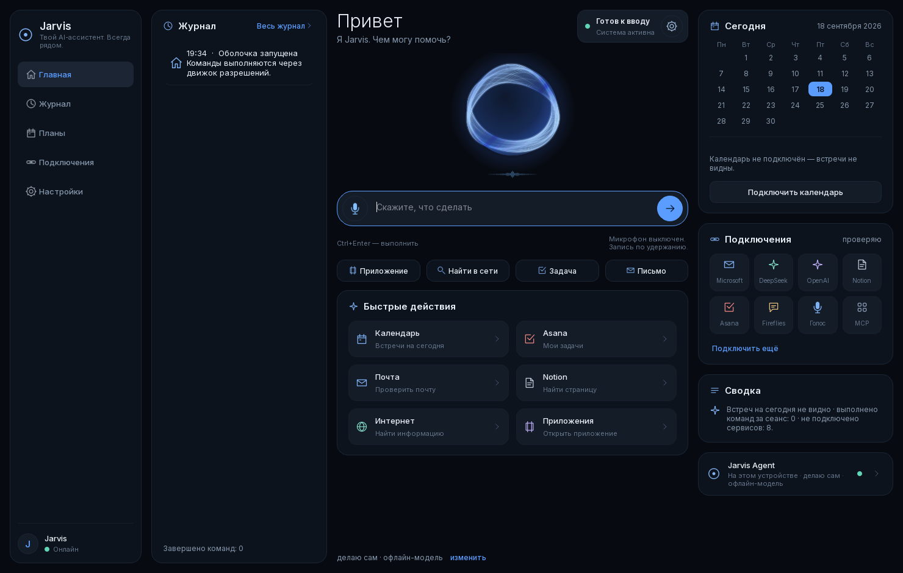
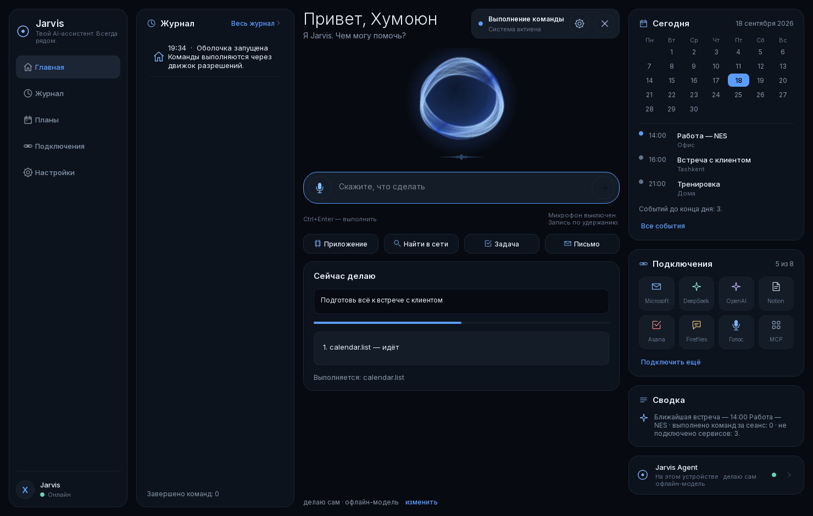
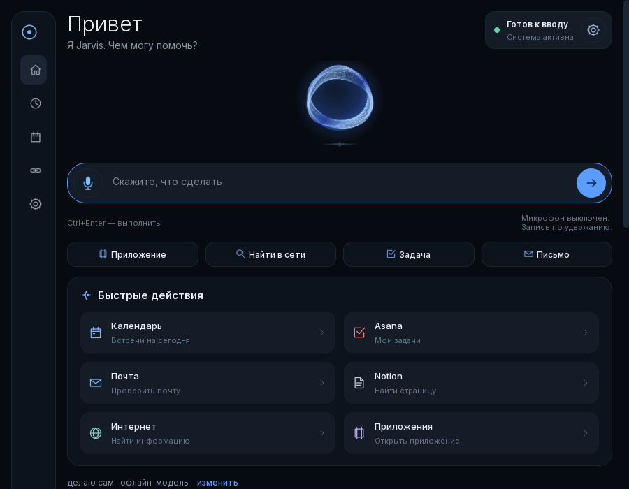

# Главный экран

Владелец открыл приложение и сказал: топорно, кнопки и функции непонятные, слишком сырое.
Он был прав. Первый заход починил порядок — команда наверх, работа под неё, лишнее прочь.
Второй, по присланному образцу, починил вид: тёмная рабочая среда с четырьмя зонами,
сфера как главный элемент и панели, которые говорят, что происходит на самом деле.

## Четыре зоны

**Рейл слева** — кто это и куда идти: логотип с подписью, пять пунктов и внизу состояние
самого агента. Каждый пункт куда-то ведёт: «Главная» — к строке команды, «Журнал» — к
записи сеанса, «Планы» — к рутинам в планировщике, «Подключения» — к экрану настройки,
«Настройки» — к разделу в этом же окне, где лежат режим выполнения, модель, автономность,
слово «Джарвис», имя для приветствия, тема, анимация и вход в разрешения. Второе окно ради
переключателя больше не открывается.

**Журнал** — что уже произошло в этом сеансе: время, что случилось, подробность под ним.
«Весь журнал» открывает аудит инструментов, где записан каждый вызов.

**Центр** — то, ради чего окно открывают. Приветствие по имени, состояние системы справа,
сфера, строка команды с микрофоном внутри неё, четыре коротких начала фразы и шесть целых
команд. И начала, и команды **подставляются в строку, а не запускаются**: владелец дочитывает
предложение и отправляет его сам. Как только задача пошла, карточка «Быстрые действия»
уступает место карточке работы — принятая команда, полоса хода, шаги и результат.

**День справа** — сегодняшнее число, месяц, ближайшие события, сетка сервисов, короткая
сводка и карточка агента.

## Что здесь настоящее

В образце были три встречи, «8 из 12 приложений» и готовая сводка. Это нарисованные данные,
и в этом репозитории уже однажды исправляли ровно такую ошибку: плитки неподключённых
сервисов, которые выглядели рабочими. Поэтому:

- **События** читаются из календаря — один ограниченный `calendar.list` через движок
  разрешений, в фоновом потоке, до конца текущих суток по местному времени, и только если
  действие после подготовки оказалось SAFE. Отменённая встреча не встреча. Нет аккаунта —
  карточка говорит об этом и даёт кнопку; сервис не ответил — говорит и это.
- **Сетка сервисов** спрашивает хранилище ключей Windows (по одному короткому помощнику на
  сервис, который отвечает «1» или «0» и никогда ключом), аккаунт Microsoft, установленную
  модель распознавания и проверенные MCP-серверы. Счётчик «3 из 8» — это факт про машину.
  Не подключённое выглядит не подключённым и по клику открывает настройку.
- **Сводка** складывается из того, что уже на экране: ближайшая встреча, выполненные за сеанс
  команды, число неподключённых сервисов. Никакого обращения к модели.
- **Имя** в приветствии — то, которое владелец ввёл в настройках; оно лежит рядом с
  `cloud-consent.json` в его собственной папке. Нет имени — берётся локальная часть адреса
  подключённого аккаунта Microsoft, нет и его — просто «Привет». Имя не угадывается.

## Как это выглядит во время работы

Состояние переезжает в пилюлю у приветствия, рядом появляется кнопка остановки — её нет,
пока останавливать нечего. Ниже принятая команда, полоса хода и шаги с отметками «идёт» и
«готово»; список ровно такой высоты, какая нужна шагам.

## Размеры окна

Три раскладки, одно правило: рейл держит свою ширину, а команда — середину.

| Ширина | Что на экране |
| --- | --- |
| от 1400 | четыре зоны рядом; журнал 288, день 320, остальное команде |
| 1180–1400 | журнал отдаёт своё место работе, остаются три зоны |
| до 1180 | рейл сворачивается в иконки, команда сверху, журнал и день под ней |

Горизонтальной прокрутки нет ни на одной из них, в том числе при минимальных 860 × 640.

## Что осталось на месте

Механика не тронута: тот же движок разрешений, те же подтверждения, тот же планировщик и
тот же аудит. Ctrl+Enter выполняет, Esc останавливает, микрофон пишет только пока его
держат, автономность остаётся явной и видимой настройкой. Переключатели — те же виджеты,
просто лежат в разделе, который открывают, а не стоят между сферой и строкой.

## Проверки

`tests/integration/test_dashboard_ui.py` — приветствие и имя, которое не имя; быстрые
действия, подставляющие команду; день с событиями и день без календаря; сетка, где
неподключённое не выглядит подключённым; пять пунктов навигации, каждый из которых
что-то открывает. `tests/unit/test_today.py` — диапазон до конца местных суток, отказ от
всего, что не SAFE, отменённая встреча, сломанный сервис и битый ответ.
`tests/unit/test_home_preferences.py` — имя переживает перезапуск, а токен именем не станет.
Плюс прежние `tests/integration/test_shell.py` и `test_long_task_ui.py`.

Снимки в этом документе — настоящий рендер окна (`QWidget.grab()` в offscreen-режиме), а не
макет. Окно дополнительно открывалось на нативном плагине `windows`: горизонтальная
прокрутка нулевая, панели и сетка сервисов отрисованы с настоящим состоянием этой машины.
