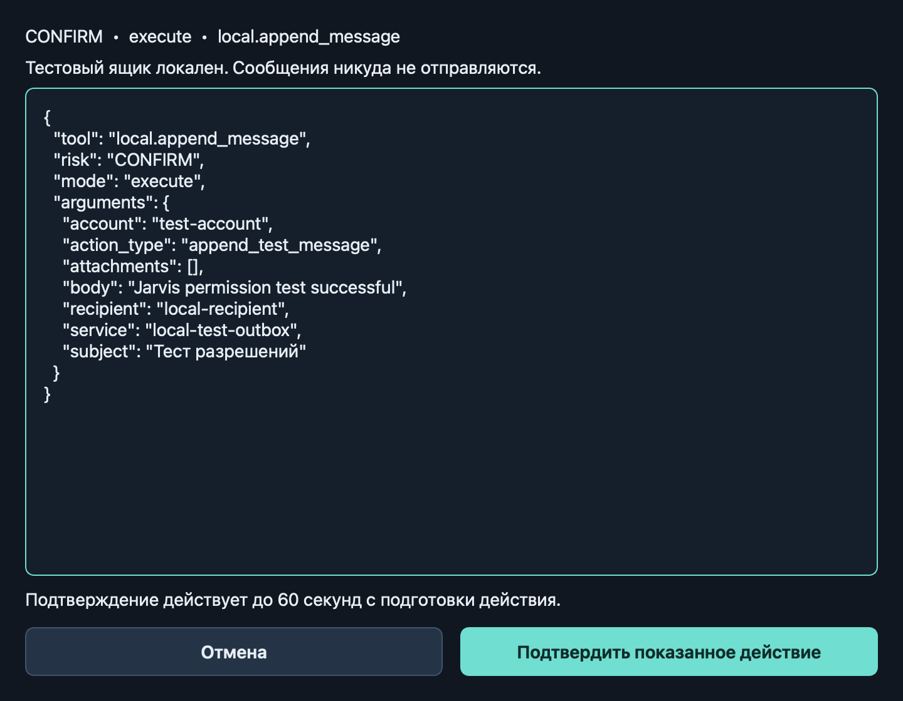
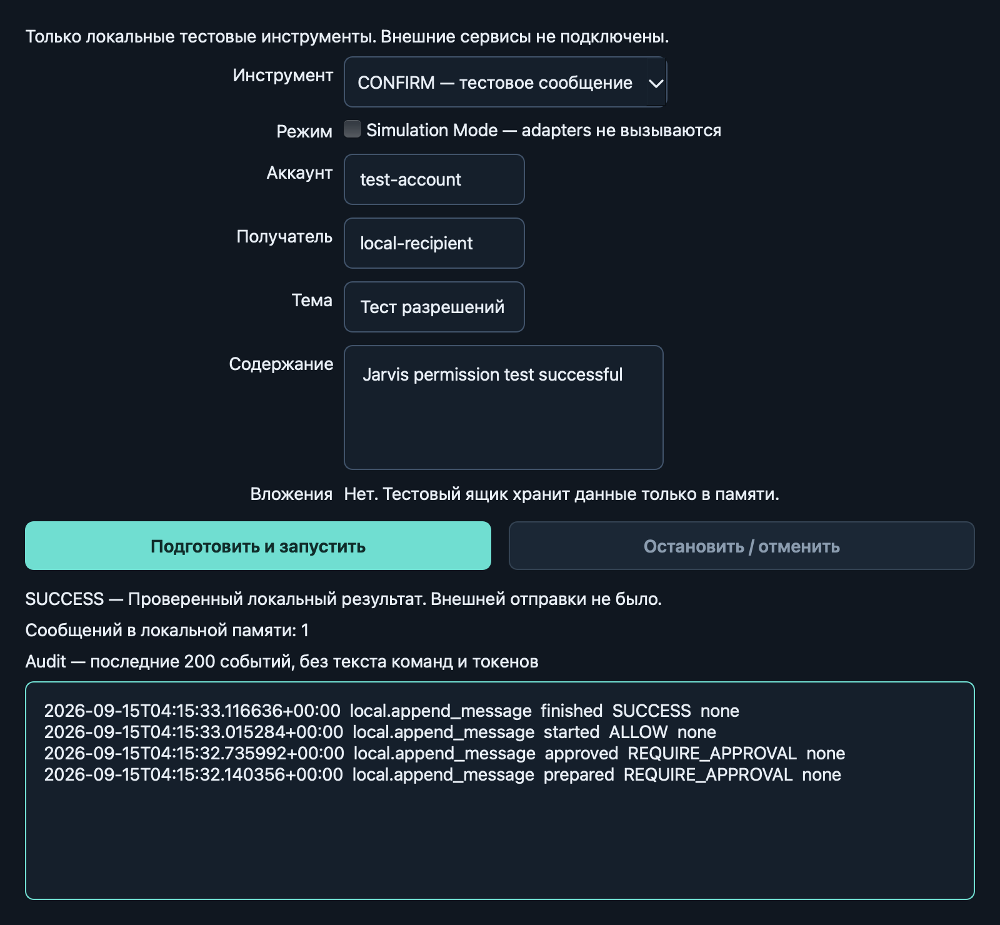

# Этап 2 — Tool Registry и Permission Engine

Реализация: 2026-09-15. Проверено локально на macOS arm64, Python 3.12.7.
Windows 11 недоступен: его native-приёмка остаётся открытой.

## Что работает

- Реестр инструментов со строгими Pydantic-схемами входа и результата. После создания
  PermissionEngine реестр закрыт для изменений; неизвестные поля и coercion запрещены.
- Детерминированные SAFE / CONFIRM / CRITICAL / BLOCKED. SAFE выполняется без approval,
  CONFIRM требует точного подтверждения, CRITICAL и BLOCKED не исполняются.
- Неизменяемый JSON snapshot включает инструмент, риск, режим и все параметры действия.
  Одноразовый token связан с snapshot и request ID; действует до 60 секунд от подготовки.
  Изменение действия, отмена, истечение срока или повторное применение не дают исполнения.
  Потребление token атомарно, в том числе при конкурентных запросах.
- Окно подтверждения показывает полный snapshot обычным текстом. Authority выдаёт token
  через обработчик кнопки; вызов одного `dialog.accept()` ничего не разрешает.
- Simulation Mode включён по умолчанию, проверяет policy и approval, но не вызывает
  ни preconditions, ни execute, ни verify адаптера.
- Настоящий запуск проверяет preconditions, схему результата и verifier. Stop, timeout
  и закрытие окна отменяют кооперативные async-задачи; UI ожидает завершения worker.
- SQLite audit фиксирует подготовку, одобрение, запуск и фактический исход. Ошибка
  обязательной записи до адаптера блокирует запуск; ошибка после эффекта не даёт SUCCESS.
  Payload, текст результата, exception и token не сохраняются.
- Окно «Проверить разрешения» запускает локальные тестовые инструменты через движок.
  Подтверждённое сообщение добавляется только в память процесса; внешней отправки нет.

## Изменённые файлы

- `src/jarvis/tools/base.py`, `registry.py`, `local.py` — контракты, реестр и тестовые tools.
- `src/jarvis/permissions/policies.py`, `approvals.py`, `engine.py` — policy, token protocol,
  исполнение, верификация и отмена.
- `src/jarvis/observability/audit.py` — durable metadata-only audit.
- `src/jarvis/ui/approval_dialog.py`, `permission_workbench.py`, `tool_worker.py`,
  `main_window.py`, `theme.py` — preview, локальная проверка, worker и подключение к GUI.
- `tests/unit/test_permissions.py`, `tests/integration/test_permission_ui.py` — новые
  проверки; `tests/integration/test_shell.py` учитывает доступную кнопку permissions.
- `pyproject.toml` — Pydantic; README, AGENTS и документы архитектуры, безопасности,
  совместимости, тестирования и roadmap отражают фактический этап.

## Проверки и результаты

Команды ниже выполнялись через `.venv/bin/python`. Обычные Qt-тесты используют offscreen.

| Команда/проверка | Фактический результат |
| --- | --- |
| `python -m pytest tests/unit/test_permissions.py tests/integration/test_permission_ui.py` | 62 passed |
| `python -m pytest` | 91 passed |
| `QT_QPA_PLATFORM=cocoa python -m pytest tests/integration/test_permission_ui.py tests/integration/test_shell.py` | 27 passed с native macOS plugin |
| `python -m ruff check .` | All checks passed |
| `python -m ruff format --check .` | Форматирование проходит |
| `python -m mypy` | No issues found in 37 source files |
| `python -m pip check` | No broken requirements found |
| Настоящий GUI, CONFIRM / EXECUTE, QTest click по кнопке approval | До click token отсутствует и outbox = 0; после click SUCCESS и outbox = 1 |
| Визуальная проверка окон | Preview и результат читаемы, без обрезания; снимки сохранены выше |
| `python -m build` | Собраны sdist и wheel из sdist |
| Установка wheel с зависимостями в чистый временный venv вне workspace | Успешно; `python -I -m jarvis --smoke-test` с Cocoa возвращает success / exit 0 |
| Проверка permissions из установленного wheel через `python -I` | CONFIRM без token → DENIED; SAFE simulation → SIMULATED; outbox = 0, audit записан |

Негативные тесты покрывают подмену полей и вложенных attachments, expiry во время
preconditions, replay, неправильный token, конкурентное потребление, отмену до старта
worker и во время работы, timeout, ошибочный result/verifier и отказы audit. Simulation
отдельно проверяется на отсутствие всех adapter hooks. Закрытие/отмена preview и обычный
`accept()` не предоставляют approval.

## Решения и ограничения

1. Authority доступна только доверенной UI-композиции. Это граница приложения, а не
   sandbox против произвольного вредоносного Python-кода в том же процессе.
2. Отмена кооперативная. Блокирующие Windows/native вызовы потребуют отдельной границы
   исполнения на этапе 3. Отмена после начала адаптера не гарантирует откат эффекта.
3. Attachments сейчас являются метаданными тестовой схемы. Реальные файлы не читаются
   и не отправляются; будущий адаптер должен проверить соответствие байтов snapshot.
4. Audit намеренно опускает весь payload. Это не универсальная redaction для будущих
   SDK. SQLite пока без политики ротации; локальный outbox очищается с закрытием окна.
5. CLI `--smoke-test` проверяет demo shell и никогда автоматически не одобряет действия.
   Основной текстовый ввод остаётся демо; planner, голос и внешние сервисы не подключены.
6. Зависимости не закреплены до проверки Windows. Версии текущего окружения и официальные
   источники записаны в [COMPATIBILITY.md](COMPATIBILITY.md).
7. Windows-проверка не выполнена. Точные PowerShell-команды и ручная приёмка находятся
   в [TESTING.md](TESTING.md). Успех Cocoa/offscreen не доказывает Windows-поведение.
8. Изменения остаются локальными; commit и push не выполнялись. Полный MVP не завершён.

## Следующий этап

Этап 3: Windows Automation — allowlist приложений, open/focus/list/type, точная привязка
к окну и контролу, ограниченные native-вызовы, ввод и read-back в Notepad без потери
несохранённых данных. Точный следующий prompt находится в [ROADMAP.md](ROADMAP.md).
