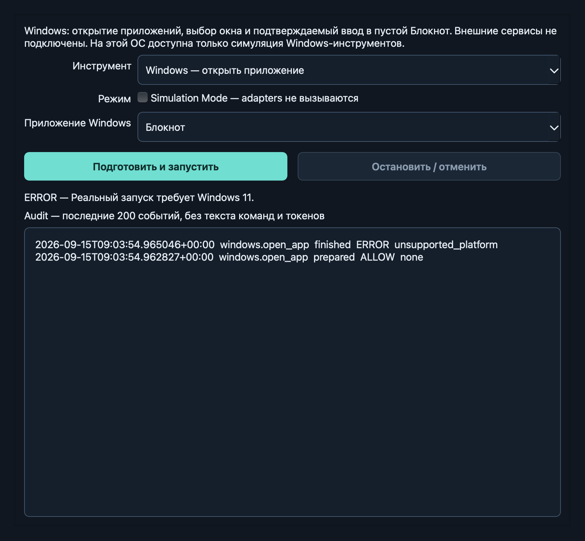

# Этап 3 — Windows Automation

Дата: 2026-09-15. Реализация и portable-проверки выполнены на macOS arm64 / Python 3.12.7.
**Настоящая Windows 11 недоступна: native-приёмка остаётся открытой.**

## Реализовано

- `windows.open_app`, `windows.focus_app`, `windows.get_open_windows` (SAFE) и
  `windows.type_text` (CONFIRM), strict schemas, PermissionEngine, simulation, audit.
- Allowlist Notepad/Chrome/VS Code по стандартным полным путям executable; поддержан
  путь packaged Notepad. Нет произвольного shell, executable/argv и поиска через PATH.
- Открытие наблюдает окно; уже открытое приложение используется повторно. Focus
  проверяет foreground HWND. Список содержит только разрешённые приложения.
- Цель связывает PID/время создания процесса, executable, HWND, UIA runtime ID/title;
  ввод дополнительно связывает editor runtime ID/role/class/automation ID/HWND и вкладку.
- Ввод только в пустой Notepad Edit/RichEdit, обнаруженный через UIA. Перед записью
  target и пустота проверяются повторно. Буквальный текст отправляется в конкретный
  editor HWND через ограниченный `EM_REPLACESEL` с undo, без клавиш/clipboard/submit.
- Содержимое читается обратно через UIA и сравнивается с подтверждённым текстом,
  затем повторно читается verifier. Результат не считается успешным по одному API-вызову.
- Native-код выполняется в отдельном helper: 8 секунд на вызов, 30 секунд на tool.
  Timeout/stop убивают и ожидают helper, включая отмену в момент его создания.
  Ограничены protocol buffers; UTF-8 payload идёт по stdin, не через argv или файлы.
- UI позволяет выбрать приложение и наблюдённое окно, показывает полный approval,
  прячет лишние поля и сообщает отсутствующее приложение, устаревший target и неподдерживаемую ОС.
- Реальные Windows-зависимости загружаются лениво только в helper; simulation не
  запускает его и не вызывает даже read-only adapter hooks.

## Файлы

- `src/jarvis/tools/windows.py` — schemas и регистрация четырёх инструментов.
- `src/jarvis/platforms/windows/{transport,worker,native}.py` — subprocess protocol,
  ограничение времени и Windows UIA/Win32 adapter.
- `src/jarvis/tools/base.py`, `permissions/engine.py`, `observability/audit.py` —
  конечные категории adapter failures без передачи raw exception.
- `src/jarvis/ui/permission_workbench.py`, `main_window.py` — ручная UI-интеграция.
- `tests/unit/test_windows.py`, `test_windows_native.py`,
  `tests/integration/test_windows_ui.py`, `tests/windows_support.py` — portable checks.
- `tests/e2e/test_windows_acceptance.py`, `tests/conftest.py` — настоящие opt-in
  Windows-сценарии; по умолчанию не выполняются.
- `pyproject.toml`, README, AGENTS, архитектура, безопасность, совместимость,
  тестирование и roadmap обновлены под этап 3.

## Проверки

Команды выполнялись через `.venv/bin/python` в изолированном окружении.

| Проверка | Фактический результат |
| --- | --- |
| `python -m pip install -e ".[dev]"` | Успешно; Windows-only зависимости на Mac не устанавливаются |
| Focused Windows contract/native-decision/UI tests | 42 passed |
| `python -m pytest` | 133 passed, 3 native Windows acceptance tests skipped |
| Native Cocoa GUI suite: shell + permissions + Windows UI probe | 29 passed |
| `python -m ruff check .` / `format --check .` | Пройдено, все Python-файлы отформатированы |
| `python -m mypy` и `python -m mypy --platform win32` | No issues found in 49 source files; это статическая проверка |
| `python -m pip check` | No broken requirements found |
| `QT_QPA_PLATFORM=cocoa python -m jarvis --smoke-test` | success, exit 0 |
| `QT_QPA_PLATFORM=cocoa python -m jarvis` | Настоящее окно открылось; AX inspection видит этап 3 и окно инструментов |
| Native Qt visual harness | Подтверждён явный unsupported-platform result и штатный shutdown |
| `python -m build` | Собраны sdist и wheel из sdist |
| Установка wheel в чистый временный venv вне workspace | Успешно; `python -I -m jarvis --smoke-test` с Cocoa: success, exit 0 |
| Проверка установленного wheel через `python -I` | Helper включён и отвечает по протоколу; simulation не импортирует pywinauto/psutil; реальный вызов на Mac возвращает unsupported_platform |

GUI probes не запускают Windows-адаптер. Native adapter decision tests используют fake UIA
objects; transport tests запускают настоящие временные Python-процессы на Mac. Проверены
hang, stop, cancellation во время создания, invalid/oversized reply и kill/reap. Tests
проверяют также подмену approval/identity/вкладки, непустой редактор, schema extras/coercion,
missing app, ошибочный read-back и отсутствие любых native hooks в simulation.

## Решения и ограничения

1. Ввод в Chrome/VS Code отсутствует: их формы/терминал могут иметь внешние эффекты.
   Этап 3 поддерживает там только открытие, список и фокус. Текст в Notepad всегда CONFIRM.
2. Notepad-версия должна иметь главное окно класса Notepad и поддерживаемый Edit/Document с native HWND,
   читаемым текстом и однозначной выбранной вкладкой. Иначе отказ без keyboard fallback.
   Modern/Store Notepad пока не проверен на настоящей Windows.
3. Существующий текст не заменяется, документы не закрываются и не сохраняются.
   Восстановленную непустую вкладку нужно подготовить вручную. Остаётся короткая гонка
   между последней проверкой и Windows-сообщением: нет атомарного compare-and-write.
   Не редактировать целевую вкладку одновременно с подтверждённым вводом.
4. Kill helper ограничивает ожидание приложения Jarvis, но не отзывает выданное OS-сообщение
   и не закрывает запущенные приложения. UI/audit сохраняют признак возможного эффекта.
5. Отдельный процесс — граница времени выполнения, не sandbox против вредоносного
   локального Python-кода или скомпрометированного allowlisted приложения.
6. Window titles и payload остаются в памяти/UI/stdio; audit их не хранит. SAFE open
   может запустить приложение с его собственной сетью и восстановлением сессии.
7. Dependencies не закреплены до Windows-приёмки. Стандартные установки поддержаны;
   custom executable paths, elevation и обход Windows focus/UIPI ограничений не добавлены.
8. Полный MVP ещё не готов. Browser automation, planner, voice и внешние сервисы не
   реализовывались. Изменения этапа 3 находятся в локальной ветке `codex/milestone-3-windows`.

## Следующий шаг

Точные PowerShell-команды и ручная Windows-приёмка находятся в [TESTING.md](TESTING.md).
Три native tests должны пройти на Windows с `--run-windows` и `QT_QPA_PLATFORM=windows`;
любые skips нужно разобрать, они не считаются успешной native-приёмкой.

Следующий этап — 4, Browser Automation. Полный следующий prompt сохранён в
[ROADMAP.md](ROADMAP.md). Незавершённая Windows-приёмка остаётся отдельным обязательством.
