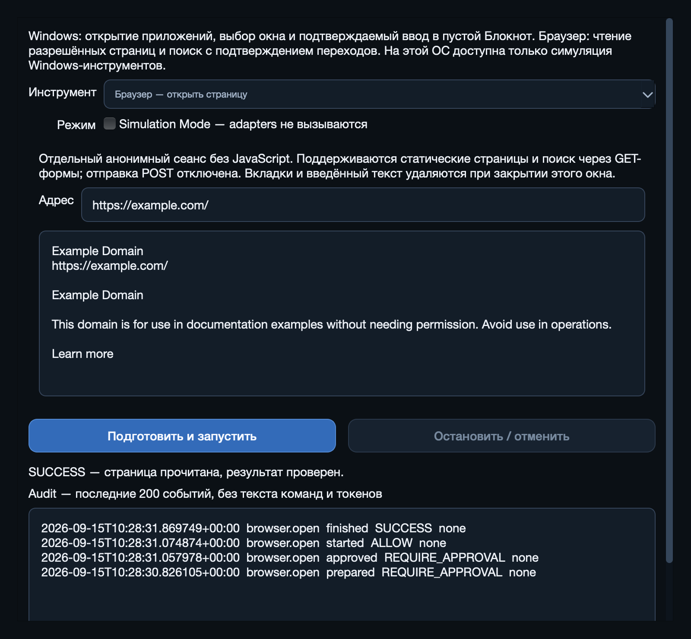
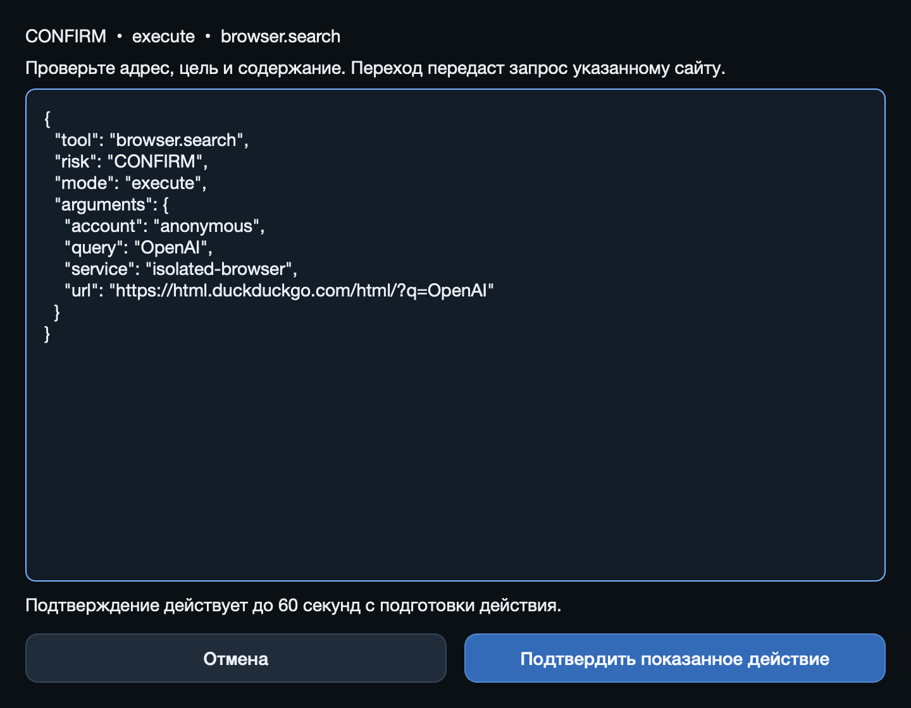

# Этап 4 — Browser Automation

Дата: 2026-09-15. Реализован локально на macOS arm64 / CPython 3.12.7.
**Windows 11 не проверена. Публичный поисковый сценарий DuckDuckGo не принят:
сайт ответил HTTP 403.** Это не мешает локальным проверкам браузерного адаптера,
но успешный fixture не заменяет реальную приёмку поиска или Windows.

## Реализовано

- Восемь зарегистрированных Playwright-инструментов: `browser.open`, `navigate`, `search`,
  `click`, `type`, `read`, `get_tabs`, `close`. В исходном плане чтение/закрытие названы
  `read_page`/`close_tab`; здесь сохранены названия из согласованного roadmap этапа 4.
- Strict schemas, immutable exact snapshots и PermissionEngine для каждого вызова.
  `read`/`get_tabs` SAFE; остальные действия CONFIRM. Чистая статическая policy выполняется
  до подготовки snapshot и в simulation; browser/DNS/hooks в simulation не вызываются.
- Собственный анонимный непостоянный Chromium context. JavaScript выключен, browser offline;
  только однократный grant главного документа разрешает отдельный HTTP transport.
- Точные HTTPS origins, публичные проверенные DNS addresses передаются connector.
  Private/mixed DNS, unsafe schemes, credentials в authority, redirects, popup, фоновые
  requests, downloads и frames блокируются. Нет cookies/auth/proxy environment или retry.
- Только однозначные semantic role + exact name. Подтверждение включает tab/document UUID,
  главный frame, URL/origin, DOM/element hash, буквальный текст и все поля формы.
  После действия результат наблюдается и независимо проверяется повторно.
- Plain text ввод через locator.fill, без клавиш/Enter/clipboard/JS из параметров. GET-формы
  показывают конечный URL и значения. Production POST запрещён: неизвестные бизнес-эффекты
  нельзя классифицировать по DOM. Для теста разрешён только constructor-injected `/submit`
  на собственном loopback server; capability отсутствует в production config и tool schemas.
- BrowserHost владеет постоянным asyncio loop вне Qt thread. Ограничены размер страницы,
  число вкладок/элементов, время HTTP/операции/tool. Отмена дожидается завершения HTTP;
  новая неоткрывшаяся вкладка удаляется, соседние вкладки сохраняются. Закрытие окна
  инструментов уничтожает явно временный сеанс, включая введённый текст.
- TLS использует системные roots, а при пустом наборе Python — Mozilla roots из certifi.
  Проверка цепочки/hostname включена; SSLKEYLOGFILE не создаёт session key log.
- Ручной интерфейс: адрес/поиск, наблюдённые вкладки и элементы, полный approval,
  буквальный вывод страницы, явные ошибки. Shell text остаётся демо; planner не добавлялся.

## Файлы

- `src/jarvis/tools/browser.py`: контракты, policy и регистрация.
- `src/jarvis/browser/{host,session,network,inspection}.py`: Playwright lifecycle,
  наблюдения, DOM verification и ограниченный HTTP transport.
- `src/jarvis/security/browser_policy.py`: exact-origin, DNS и request policy.
- `src/jarvis/tools/{base,registry}.py`: чистый synchronous policy hook для обеих modes.
- `src/jarvis/ui/browser_controls.py`, `permission_workbench.py`, `approval_dialog.py`,
  `main_window.py`: ручное выполнение через существующий PermissionEngine.
- `config.py`, `pyproject.toml`, `.env.example`: allowlist и runtime dependencies.
- `tests/browser_support.py`, `tests/unit/test_browser.py`,
  `tests/integration/test_browser.py`, `test_browser_ui.py`, `test_config.py`: проверка.
- README, AGENTS, PRD, архитектура, безопасность, совместимость, тестирование и roadmap.

В рабочей копии также сохраняются ранее реализованный этап 3 и отдельные изменения
оформления dashboard. Этот отчёт описывает браузерную часть, не приписывает ей редизайн.

## Фактическая проверка

Команды запускались через `.venv/bin/python` в изолированном окружении.

| Проверка | Результат |
| --- | --- |
| `python -m pip install -e ".[dev]"` | Успешно |
| `python -m playwright install chromium` | Chromium 151.0.7922.34 / build 1234 установлен |
| `python -m pytest` | 198 passed, 3 Windows acceptance tests skipped |
| Native Cocoa: browser UI + permissions + shell + Windows UI probe | 31 passed |
| `python -m ruff check .` / `format --check .` | Пройдено |
| `python -m mypy` / `mypy --platform win32` | Пройдено; статическая проверка не доказывает Windows |
| `python -m pip check` | No broken requirements found |
| `QT_QPA_PLATFORM=cocoa python -m jarvis --smoke-test` | success, exit 0 |
| `QT_QPA_PLATFORM=cocoa python -m jarvis` | Окно открыто; через accessibility проверено окно инструментов |
| Реальный Qt UI → `browser.search`, запрос OpenAI | Отказ; отдельная диагностика того же transport: DuckDuckGo HTTP 403 |
| Реальный Qt UI → `browser.open`, example.com | SUCCESS; заголовок Example Domain, текст прочитан; временный сеанс закрыт |
| `python -m build` | Собраны jarvis_windows-0.0.1.tar.gz и wheel из sdist |
| Clean-wheel `python -I -m jarvis --smoke-test` / `pip check` | success / No broken requirements found |
| Установка wheel в новый временный venv, запуск с `python -I` | Qt approval → Chromium read/type/GET/close, simulation и shutdown прошли; модуль загружен из установленного wheel |

Обычный suite не обращается к публичным сайтам. 13 интеграционных browser tests используют
настоящий Chromium и контролируемый HTTP server: чтение/ввод/GET и однократный POST,
нет отправки без approval, cookies/JS/background запросов, stale target, redirect, dropped
GET без retry, stop, timeout, сохранение соседних вкладок, actual DOM mutation перед
verification и unsolicited popup. Registered search проверяется с заменённым transport
на fixture, при настоящем Chromium, точном DDG URL и обычном verifier. Qt-тесты нажимают
реальные кнопки approval; одного открытия/accept диалога недостаточно.

Unit tests проверяют все восемь simulation paths без hooks, invalid schemas, подмену
approval/target/form body, отсутствие ложного success на пустом result, origin/DNS policy,
private/mixed answers, передачу проверенных addresses connector и TLS без key logging.

Локальные runtime versions: Playwright 1.62.0, aiohttp 3.14.3, certifi 2026.7.22,
Pydantic 2.13.5, PySide6-Essentials/Qt 6.11.2. Версии не закреплены до Windows-приёмки.
Остальное окружение — как в отчёте этапа 3.

## Ограничения и следующий этап

- Поддерживаются статические анонимные страницы и простые GET-формы. JavaScript, login,
  сохранение сеанса, upload, произвольный POST и user browser profiles отсутствуют.
  Результат страницы/challenge нельзя выдавать за завершённую бизнес-задачу.
- HTTP 8 секунд, browser phase 15 секунд, tool 45 секунд; cleanup использует ограниченные
  ожидания. Это не process sandbox и не гарантия hard-kill при неисправном browser binary.
  Уже выданный запрос не откатывается; UI/audit отмечают возможные эффекты.
- Введённый текст временного сеанса удаляется при закрытии окна инструментов, о чём UI
  сообщает заранее. Другие профили и открытые пользователем вкладки не подключаются.
- Разрешённый origin добавляется только доверенной настройкой; содержимое страницы
  и будущая модель не могут расширить allowlist, выдать approval или включить POST.
- Windows UIA и Chromium/Qt на настоящей Windows требуют команд из [TESTING.md](TESTING.md).
  Публичный поиск нужно повторить в целевом окружении; HTTP 403 не обходился.
- Полный MVP не завершён. Следующий этап — 5, LLM Planner и Orchestrator; точный prompt
  находится в [ROADMAP.md](ROADMAP.md). Voice, memory и внешние сервисы не добавлялись.
- Изменения локальные, в ветке `codex/milestone-3-windows`; этап 4 не отправлялся в GitHub.
