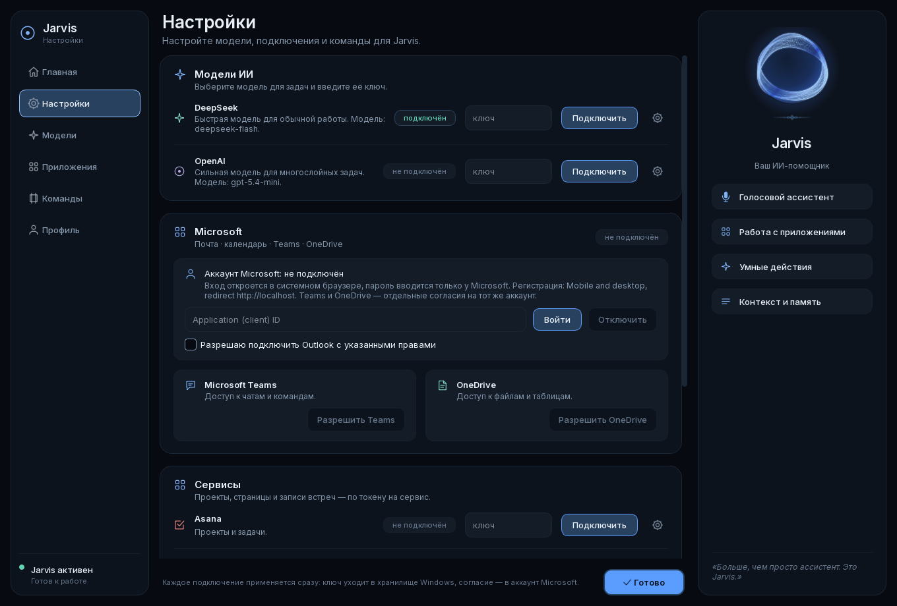

# Первый запуск: что подключить

На новой машине Jarvis не может ничего: нет ключа модели, нет почтового аккаунта, нет
токенов. Раньше он об этом молчал — окно открывалось пустым, а настройка жила во вкладке
другого окна и в командах терминала. Теперь при первом запуске открывается экран
**«Настройка»**, а дальше он всегда под рукой: кнопка «Настройка подключений» на главном
экране и «Настройки» в боковом меню.

Это список, а не мастер. Подключайте в любом порядке и ровно то, что нужно; пропущенное
останется неподключённым и честно об этом скажет.

## Как устроен экран

Три зоны, те же, что на главном экране: рейл слева, работа посередине, одна тихая колонка
справа. Три пункта рейла — «Настройки», «Модели», «Приложения» — прокручивают этот экран;
«Главная», «Команды» и «Профиль» принадлежат главному окну, и рейл просит его открыть их,
а не заводит вторую копию настроек, которыми не владеет.

Каждый сервис — строка в карточке: иконка, что он даёт, чип состояния («подключён» /
«не подключён» / «проверяю…»), поле ключа, «Подключить» и шестерёнка, под которой «Забыть
ключ» и «Проверить заново». Рядом с ключом моделей написан идентификатор, который сейчас
в работе, — но меняется он в планировщике: два редактора одного значения к вечеру
разойдутся.

Кнопка внизу называется «Готово», а не «Сохранить». Сохранять нечего: ключ уходит в
хранилище в момент нажатия «Подключить», согласие — в аккаунт Microsoft в момент входа.
Кнопка, берущая на себя чужую заслугу, — это кнопка, после которой не понимают, применилось
уже или нет.

## Что на экране

| Раздел | Что это даёт | Как подключается |
| --- | --- | --- |
| **Модели ИИ** | DeepSeek — обычная работа; OpenAI — многослойные задачи | Ключ в поле → «Подключить» |
| **Microsoft** | Почта, календарь, Teams, OneDrive | Application (client) ID, галочка согласия → «Войти». Затем «Разрешить Teams» и «Разрешить OneDrive» — отдельными согласиями |
| **Сервисы** | Asana (проекты и задачи), Notion (страницы), Fireflies (записи встреч) | Токен в поле → «Подключить» |
| **Голос** | Распознавание речи | Модель ставит установщик; экран говорит, на месте она или нет |

ElevenLabs и серверы MCP подключаются в своих местах — экран называет их, чтобы список
не читался как полный перечень того, что Jarvis умеет.

## Про пароли

**Пароль в Jarvis не вводится.** Ключ или токен уходит прямо в хранилище Windows через
короткоживущий помощник, который отвечает словом «1», «0» или «ok», а не секретом; поле на
экране доступно только на запись, потому что читать сохранённый ключ приложению незачем.
Пароль Microsoft вводится **у Microsoft**, в их окне браузера, и в это приложение не
попадает вообще.

Отключение (кнопка «Отключить») удаляет локальные токены. Само согласие отзывается в
аккаунте Microsoft — приложение не может отозвать его за вас.

## Что работает без чего

- **Без модели** — только учебные офлайн-команды. Планировщик не построит план.
- **Без Microsoft** — нет почты, календаря, Teams, OneDrive и сводки к встрече: встреча
  берётся из календаря.
- **Без Asana/Notion/Fireflies** — соответствующие разделы сводки скажут «сервис
  недоступен, не подключён или запрещён», а остальные останутся на месте.
- **Без голосовой модели** — команду можно набрать текстом.

## Где это в коде

`ui/connections_panel.py` — карточки и строки сервисов; `ui/setup_window.py` — три зоны
вокруг них, рейл и признак первого запуска (`setup.json` в каталоге данных);
`ui/connection_task.py` — одна запись в аудит на каждую операцию с аккаунтом, общая для
этого экрана и вкладки «Outlook». Те же карточки показываются во вкладке «Подключения»
планировщика — это один виджет, а не две копии.
Проверки: `tests/integration/test_setup_ui.py`, `tests/integration/test_connections_ui.py`.

Снимок выше — настоящий рендер окна (`QWidget.grab()` в offscreen-режиме). Состояние на
нём — фикстура из тестов (подключён только DeepSeek): настоящее содержимое хранилища
ключей этой машины в документацию не попадает.

**Живой вход Microsoft ещё не проверялся** — нужен личный аккаунт владельца.
