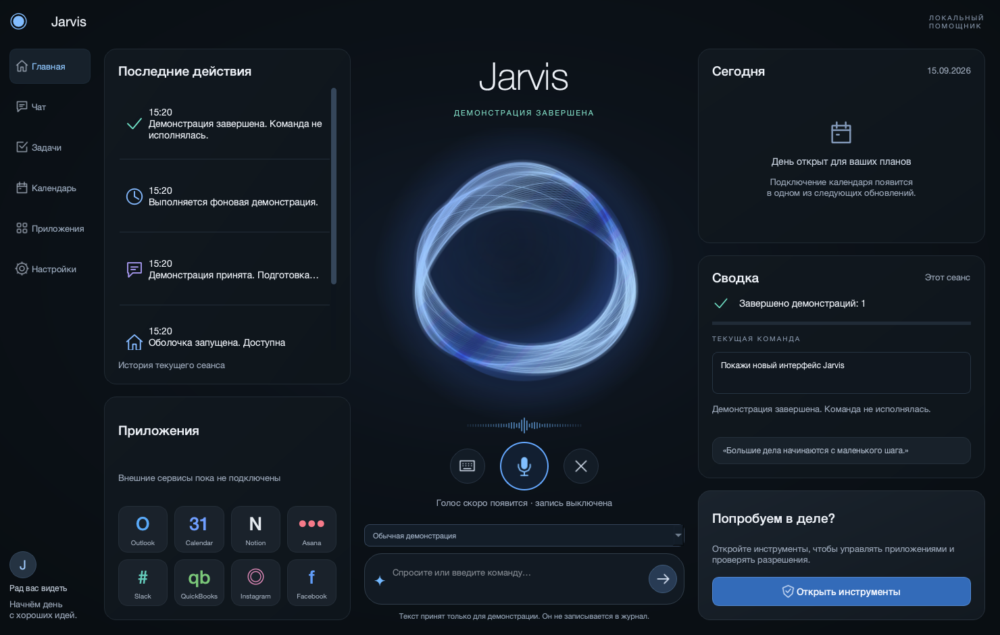

# Jarvis — интерфейс по визуальному образцу

Дата: 15 сентября 2026. Изменение существующего PySide6 desktop shell по изображению
пользователя: тёмный фон, тонкие границы панелей, навигация слева, история и приложения,
световая сфера и ввод в центре, календарь, сводка и предложение справа.



## Что изменилось

- `src/jarvis/ui/main_window.py`: dashboard с русскими подписями; пункты меню переводят
  фокус к соответствующим областям, «Чат» — к вводу, «Настройки» — к существующему окну
  инструментов. Кнопка со стрелкой выполняет команду; Ctrl+Enter и Esc сохранены.
Круглая кнопка микрофона — удержание: запись идёт только пока она нажата, подпись под ней
показывает состояние микрофона.
- `src/jarvis/ui/dashboard.py`: локальные контурные иконки и сфера с мягким свечением,
  медленным вращением и пульсацией. Дорогая отрисовка световых линий кешируется;
  каждый кадр только выводит готовое изображение. Таймер останавливается при скрытии.
- `src/jarvis/ui/theme.py`: палитра, типографика, карточки и круглые кнопки; существующие
  формы разрешений продолжают использовать общие читаемые стили и keyboard focus.
- `src/jarvis/ui/activity_log.py`: реальные ограниченные по количеству события сеанса
  с временем и иконками. Сводка считает только завершённые команды этого сеанса.
- `docs/images/dashboard-reference.png`: реальный Qt-render после успешного локального демо.

Нет новых зависимостей или внешних графических ресурсов. Календарь показывает пустое
состояние, плитки сервисов явно помечены как неподключённые. Микрофон отключён, запись
не ведётся. Декоративная волна не представляет аудиосигнал. Новые этапы продукта не
реализованы; существующие Windows/browser/permission adapters сохранены.

Окно по умолчанию 1480 × 940. Минимум окна — 860 × 640; содержимое не сжимается ниже
1230 × 840 и доступно через горизонтальную и вертикальную прокрутку. Системная рамка
остаётся нативной. Это адаптация композиции образца к реальным возможностям приложения.

## Проверки на macOS

Установка: `.venv/bin/python -m pip install -e ".[dev]"` — успешно.

- `.venv/bin/python -m pytest` — **196 passed, 3 skipped** (Windows opt-in).
- `.venv/bin/python -m ruff check .` — успешно.
- `.venv/bin/python -m ruff format --check .` — 75 файлов, успешно.
- Native Cocoa: `QT_QPA_PLATFORM=cocoa .venv/bin/python -m pytest
  tests/integration/test_shell.py tests/integration/test_permission_ui.py
  tests/integration/test_windows_ui.py -q` — **29 passed**.
- После финальной оптимизации сферы повторный native shell suite — **14 passed**.
- Отдельно проверены навигация, счётчик завершённых демо и обе полосы прокрутки
  при 860 × 640. PNG осмотрен визуально при 1480 × 940 и при минимальном размере окна.
- `QT_QPA_PLATFORM=cocoa .venv/bin/python -m jarvis` запускался. Интерактивная проверка
  через computer-use была недоступна из-за ошибки macOS ScreenCaptureKit (-3811);
  её не подменяем утверждением об успешной ручной приёмке. Native Qt tests прошли.

Первоначальная отрисовка каждого кадра занимала около 80 мс и вызвала сбой native-теста
отзывчивости. После кеширования повторный кадр в локальном измерении занимает менее
1 мс; native-тест отзывчивости проходит без изменения теста.

В рабочей копии уже были изменения этапов Windows/browser. Полный набор тестов вырос
во время работы со 186 до 196 проходящих тестов. Один длинный комментарий в существующем
browser-тесте перенесён на две строки для Ruff; поведение этого теста не менялось.

## Windows — проверка ещё требуется

Из корня репозитория в PowerShell:

```powershell
.\.venv\Scripts\python.exe -m pip install -e ".[dev]"
$env:QT_QPA_PLATFORM = "windows"
.\.venv\Scripts\python.exe -m pytest tests/integration/test_shell.py tests/integration/test_permission_ui.py
.\.venv\Scripts\python.exe -m jarvis --smoke-test
.\.venv\Scripts\python.exe -m jarvis
Remove-Item Env:QT_QPA_PLATFORM
.\.venv\Scripts\python.exe -m build
```

Проверить 100%/150%/200% DPI, изменение размера, навигацию, ввод, Ctrl+Enter, отмену Esc,
диалог инструментов и закрытие окна во время демо. Проверки macOS не доказывают работу
Windows UIA или завершение всего MVP.

## Финальные type / smoke / build

- `.venv/bin/python -m mypy --cache-dir /tmp/jarvis-dashboard-mypy-cache --show-traceback`
  — **Success: no issues found in 62 source files**. Обычный запуск ранее проходил,
  но последний повтор с общим кешем завершился внутренней ошибкой mypy в aiohttp;
  чистый отдельный кеш прошёл без изменений зависимостей или проверяемого кода.
- `.venv/bin/python -m jarvis --smoke-test` — **Jarvis GUI smoke: success**.
- `.venv/bin/python -m build` — успешно собраны wheel и sdist.
